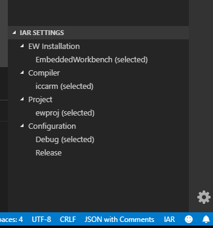

# iar-vsc cross-platform

For the original readme of the project this is based on, see [here](https://github.com/pluyckx/iar-vsc).

This is a fork of the `iar-vsc` VS Code extension for using the IAR
EW development tools together with VS Code.

## Using the extension
To use the extension, first make sure you have installed the `C/C++` extension
from Microsoft (also known as `cpptools`). Then install Nodejs and run
`npm install` in this folder to install all dependencies.
Once it's done, you may open this folder in a VS Code
window and press F5 to debug the extension. This will launch a new VS Code
window where the extension is activated.

## Improvements

This fork has the following improvements over the original extension:

### Cross platform

The original extension only worked on windows, but this version works on linux too (and theoretically also on mac). The only changes needed
for this was to add a function for detecting the OS the extension is running on
(see `utils.ts`),
and to customize the file names used according to the OS (i.e. not using `.exe` on linux).

### C-STAT integration

This fork allows the user to run C-STAT from within VS Code, and displays the
warnings in VS Code's `Problems` window as well as in any open file.
This is done via the command window: `Ctrl+shift+P->Run C-STAT Analysis`
(there is also a command for clearing the warnings). There are also two settings
for filtering out low severity messages and for displaying low severity messages
as hints rather than warnings.

The warnings are generated by running `IarBuild` with the `-cstat_analyze`
parameter, which in turn generates a `<config>/Obj/cstat.db` file in the
EW project folder.
I use the official sqlite binaries (see the `sqlite-bin/` folder), which let me
query the database via a stdin/out interface, and simply `SELECT` and parse the relevant
columns from the `warnings` table.
For the implementation, see `cstat.ts`, `cstatDiagnostics.ts` and commit
`f639276`.

Note: there are sqlite libraries for Node which would have been easier to use
than these binaries, but I couldn't get them to build properly for VS Code/electron.

### Autoselection of tools/compiler/project/configuration

The extension automatically detects available EW installations, platform specific compilers, projects and build configurations,
and allows the user to choose between these at a bar at the bottom of the VSC window.
The original extension does not automatically set any of these settings, so the user has to manually select which EW installation, compiler etc. to use
every time they open a new project.
This version has been changed to select the first option for each of the settings, which should make it easier to use in the majority of cases.

This was done by changing the `Model` class and subclasses to automatically
select the first item whenever its dataset is changed.

### Settings UI

This version of the extension also includes a dedicated view for managing the settings mentioned above.

The tree UI is defined in `src/extension/ui/treeselectionview.ts`,
and is registered in `src/main.ts`.

### Setting `compilerPath`

By default, the `cpptools` extension looks for installed known compilers to find
include paths or predefined macros, which leads to some incorrect
suggestions by IntelliSense. This extensions sets the `compilerPath`
setting of the `cpptools` extension to an empty string, to force it
to use only the explicitly provided include paths and macros. This problem will be
fixed by the original extension developer in the next release (see [this
issue](https://github.com/pluyckx/iar-vsc/issues/54)).

### Highlighting of IAR extended C/C++ keywords

VS Code allows extensions to *inject* grammars into existing syntax highlighting
rules ([see here](https://code.visualstudio.com/api/language-extensions/syntax-highlight-guide#creating-a-basic-injection-grammar)).
In this extension I've used this to make VS Code mark some IAR extended
keywords (`__no_init` and `__ro_placement`) as actual C keywords.

The implementation is fairly simple. First, I registered a new grammar (i.e.
a set of highlighting rules) in the `package.json` file, and pointed it to the
`syntaxes/iar-c-cpp.tmLanguage.json` file, where the actual rules are. I chose
to inject my rules into the `source.c` scope, which is the root-level scope for
C files (meaning my rules will apply to the entire C file).
The rules are simple regular expressions, matching against any use of the
keywords that is followed by a whitespace.

This changes the highlighting for VS Code's default highlighting engine, but
`cpptools` has its own more intelligent highlighting engine, that overrides the
default one. I couldn't find any way to inject grammers into that one, but it
can be disabled via the `C_Cpp.enhancedColorization` setting.

I also added the IAR keywords as predefined macros added to
`c_cpp_properties.json`. This makes `cpptools` treat them as macros rather than
as errors (not a pretty solution, but works pretty well).

For the exact changes made see commit `5fcfbbe`.

## Future improvements

The following are some improvements that *could* be implemented, but that I
haven't had the time for.

### Better way of generating macros/include paths

The way that the extension generates include paths and compiler-defined macros
is incorrect.
It calls the compiler (e.g. `iccarm.exe`) directly
with the `--predef-macro` and `--IDE3` flags, with an empty `.c` file to
compile, and parses the output.
This way, it misses paths and macros defined only by `IarBuild.exe`,
such as those defined by the user in the project settings.

The `politoleo/iar` extension does this in a better way, in these steps:

+ Building the project with `IarBuild.exe`, setting `-log all`.
+ Parsing the output to determine the calls `IarBuild` makes to `iccarm.exe`.
+ Repeating the calls to `iccarm.exe` with exactly the same flags, adding the `--predef-macros`, `--IDE3`
  and `--NCG` flags, parsing the output.

This way, even the paths and macros `IarBuild.exe` passes on to `iccarm.exe` are
caught. It's even possible to detect the includes/macros on a
per-file basis, in case the user has different settings for different files. The
`cpptools` extension supports having per-file settings, though it might take
some work to integrate with this extension. There are two ways to configure
`cpptools`, either through a json file (which is what this extension uses) or
through a typescript api; having individual settings per file isn't supported in
the json format.
